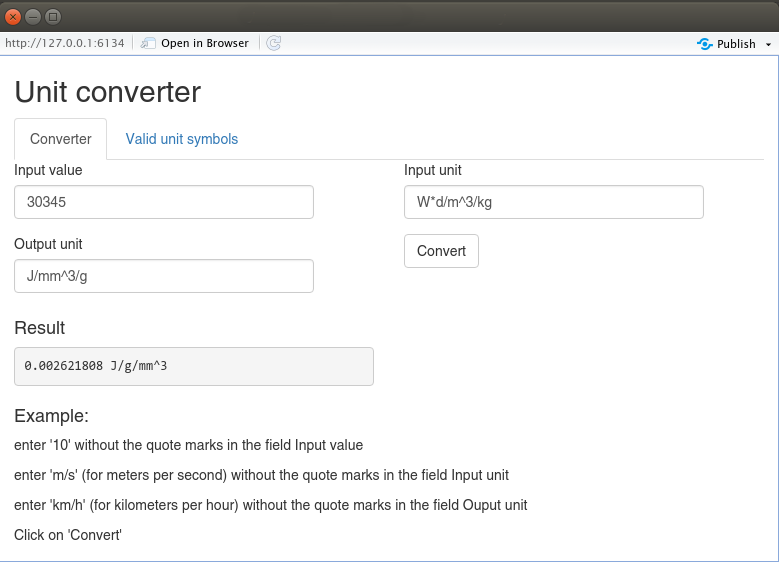

# `runitconverter` - A shiny app for unit conversion

**If you have any questions, comments or suggestions, feel free to contact me (in english, french or german):**
**emanuel.huber@pm.me**


This is a R package with a single function `runiconv()` that launches
a shiny app to convert units. This app is base on the great R package
`units`.

## Installation and run

You need first to install [R](https://cran.r-project.org/). 

In R, enter:

```r
if(!require("devtools")) install.packages("devtools")
devtools::install_github("emanuelhuber/runitconverter")

library(runitconverter)

runitconv()

```


## Screenshot

A picture is worth 1000 words:




## Misc

My current affiliation:

```
Emanuel Huber,
GEOTEST AG
Bernstrasse 165
3052 Zollikofen 
Switzerland
```
